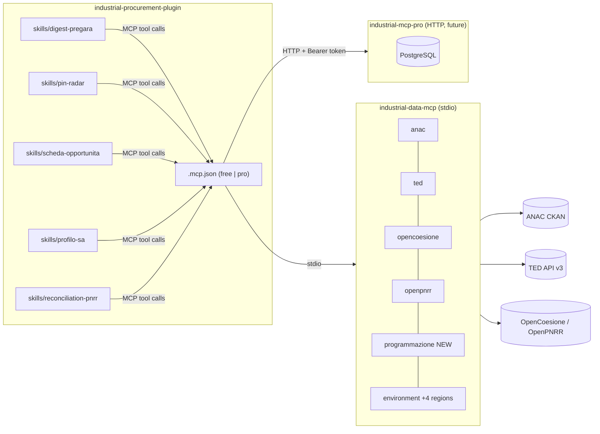

# Procurement Plugin: MCP Extensions First, Detailed Skill Protocol

## Context

The `industrial-procurement-plugin` is a Claude Code plugin that gives users natural-language access to the Italian public spending ecosystem, producing professional-quality Italian-language outputs with full provenance. The plugin is an orchestration layer only: all data retrieval happens through the `industrial-data-mcp` MCP server (sibling repo, FastMCP 2.x, 12 source modules). Four MCP tool gaps must be closed before the five plugin skills can run without degradation: a `programmazione.py` source module for regional biennale/triennale datasets, a `ted_pin_italy` convenience filter, two OpenCoesione bulk-download helpers, and four additional regional VAS/VIA portal link-builders. Only after those gaps are closed do the five SKILL.md files get written, each encoding an explicit Italian-language tool-call protocol that Claude follows deterministically.

## Decisions made

| # | Decision | Chosen | Rejected | Rationale |
|---|----------|--------|----------|-----------|
| 1 | Development order | MCP extensions first, then plugin skills | Interleaved per-capability; plugin skills first | Cleaner dependency chain; skills never need degraded-mode fallbacks |
| 2 | Free/pro config mechanism | Environment variables in `.mcp.json` (INDUSTRIAL_MCP_MODE, INDUSTRIAL_MCP_PRO_URL, INDUSTRIAL_MCP_PRO_TOKEN); `headersHelper` for API key | settings.json mcpServers; /industrial-setup skill | Native `${VAR}` substitution in `.mcp.json` headers is a known Claude Code bug (issue #51581); `headersHelper` is the confirmed workaround |
| 3 | SKILL.md prompt style | Detailed protocol (explicit tool-call sequence, Italian output sections, confidence vocabulary) | Minimal orchestration prompt | Output quality requirements in the context doc are too specific for Claude to infer reliably; deterministic protocol prevents drift |

## Architecture



## Tasks

### Task 1: Add programmazione.py source module

**Target files**:
- `../industrial-data-mcp/src/industrial_mcp/sources/programmazione.py` (new)

**Change**:
Create `programmazione.py` following the flat pattern of `anac.py`: a `SOURCE = "programmazione"` constant, a module-level `DATASET_REGISTRY: dict[str, dict]` with four entries keyed by `"{region}_{year}"` (Lombardia ARIFL 2024, Puglia acquisti 2025, Puglia OO.PP. 2024-2026, Autorità Idrica Pugliese 2025) each containing `title`, `region`, `anno`, `download_url`, and `format`. Define `async def search_biennale(cpv: str | None, regione: str | None, anno: int | None) -> Page` that filters the registry dict in-memory (no HTTP call) and returns a `Page` from `industrial_mcp.models`. Register it as `programmazione_search_biennale` inside `register(mcp: FastMCP) -> None`.

**Tests (TDD)**:
- File: `../industrial-data-mcp/tests/test_url_builders.py` (modify)
- Test name: `test_programmazione_search_biennale_returns_page` and `test_programmazione_search_biennale_filters_by_region`
- Asserts: `asyncio.run(search_biennale(cpv=None, regione=None, anno=None))` returns a `Page` with `source == "programmazione"` and `count >= 1`; calling with `regione="Puglia"` returns only entries whose `region` field equals `"Puglia"`.
- This test MUST fail before implementation begins.

**Verification**:
```
cd /home/marco/personal/industrial-procurement/industrial-data-mcp && python -m pytest tests/test_url_builders.py -k programmazione -x -q
```

**Depends on**: none

---

### Task 2: Add ted_pin_italy convenience tool to ted.py

**Target files**:
- `../industrial-data-mcp/src/industrial_mcp/sources/ted.py` (modify)

**Change**:
Add a module-level function `build_pin_italy_query(cpv_codes: list[str] | None, nuts_region: str | None, deadline_before: str | None) -> str` that composes a TED expert-search string: always includes `notice-type=PIN AND place-of-performance=ITA`; appends `AND classification-cpv=<cpv>` and `AND place-of-performance=<nuts>` when provided; appends a deadline clause when `deadline_before` is given. Add `async def search_pin_italy(cpv_codes, nuts_region, deadline_before, limit, page) -> Page` that calls `build_pin_italy_query` and delegates to the existing `search_notices`. Register as `ted_pin_italy` in the existing `register(mcp)` block. `build_pin_italy_query` is module-level (not nested) so it is importable in tests without constructing an `mcp` instance.

**Tests (TDD)**:
- File: `../industrial-data-mcp/tests/test_ted_mocked.py` (modify)
- Test name: `test_build_pin_italy_query_includes_f01_and_it_scope`
- Asserts: `ted.build_pin_italy_query(cpv_codes=["71000000"], nuts_region="ITC4", deadline_before=None)` returns a string containing `"notice-type=PIN"`, `"place-of-performance=ITA"`, and `"classification-cpv=71000000"`.
- This test MUST fail before implementation begins.

**Verification**:
```
cd /home/marco/personal/industrial-procurement/industrial-data-mcp && python -m pytest tests/test_ted_mocked.py -k pin_italy -x -q
```

**Depends on**: none

---

### Task 3: Add opencoesione_describe_dataset and opencoesione_download_parquet

**Target files**:
- `../industrial-data-mcp/src/industrial_mcp/sources/opencoesione.py` (modify)

**Change**:
Add `def describe_dataset(dataset_id: str) -> OpenCoesioneDataset` that calls `list_opencoesione_datasets()`, looks up by `id`, and raises `ValueError(f"dataset '{dataset_id}' not found in OpenCoesione catalog")` when absent (explicit failure, not silent `None`). Add `def download_parquet_url(dataset_id: str) -> dict[str, str]` that calls `describe_dataset` and returns `{"url": ds.download_urls["parquet"]}` or raises `ValueError` if no parquet URL exists. Register both as `opencoesione_describe_dataset` and `opencoesione_download_parquet` in the existing `register(mcp)` block. No new models needed; both reuse `OpenCoesioneDataset`.

**Tests (TDD)**:
- File: `../industrial-data-mcp/tests/test_url_builders.py` (modify)
- Test name: `test_opencoesione_describe_dataset_known_id` and `test_opencoesione_describe_dataset_raises_for_unknown`
- Asserts: `opencoesione.describe_dataset("progetti_esteso")` returns an `OpenCoesioneDataset` with `id == "progetti_esteso"`; `opencoesione.describe_dataset("nonexistent_xyz")` raises `ValueError` with `"nonexistent_xyz"` in the message.
- This test MUST fail before implementation begins.

**Verification**:
```
cd /home/marco/personal/industrial-procurement/industrial-data-mcp && python -m pytest tests/test_url_builders.py -k opencoesione_describe -x -q
```

**Depends on**: none

---

### Task 4: Extend environment.py with four regional VAS/VIA portals

**Target files**:
- `../industrial-data-mcp/src/industrial_mcp/sources/environment.py` (modify)

**Change**:
Add a `REGIONAL_PORTALS: dict[str, str]` module-level constant mapping four region slugs (`"Veneto"`, `"Lombardia"`, `"Piemonte"`, `"Lazio"`) to their public VIA/VAS base URLs. Add `def build_regional_env_link(region: str, procedure_type: str | None, proponent: str | None) -> EnvSearchLink` that looks up the region case-insensitively in `REGIONAL_PORTALS`, raises `ValueError` for unknown regions, and constructs the query string using the same parameter pattern as `build_er_search_link`. Register as `env_regional_search_link` in the existing `register(mcp)` block. Reuses `EnvSearchLink` model; no new model needed.

**Tests (TDD)**:
- File: `../industrial-data-mcp/tests/test_url_builders.py` (modify)
- Test name: `test_env_regional_link_veneto` and `test_env_regional_link_unknown_region_raises`
- Asserts: `environment.build_regional_env_link("Veneto", "VIA", None)` returns an `EnvSearchLink` with `scope == "Veneto"` whose `url` starts with the Veneto base URL; `environment.build_regional_env_link("Sardegna", None, None)` raises `ValueError`.
- This test MUST fail before implementation begins.

**Verification**:
```
cd /home/marco/personal/industrial-procurement/industrial-data-mcp && python -m pytest tests/test_url_builders.py -k env_regional -x -q
```

**Depends on**: none

---

### Task 5: Register programmazione in server.py and verify full tool set

**Target files**:
- `../industrial-data-mcp/src/industrial_mcp/server.py` (modify)

**Change**:
Add `from .sources import programmazione` to the import block and add `programmazione` to the `for module in (...)` tuple in `build_mcp()`, maintaining the existing alphabetical grouping. This is a two-line change. Verify that `test_all_expected_tools_registered` in `test_server.py` is extended to include `"programmazione_search_biennale"`, `"ted_pin_italy"`, `"opencoesione_describe_dataset"`, `"opencoesione_download_parquet"`, and `"env_regional_search_link"` in its expected set.

**Tests (TDD)**:
- File: `../industrial-data-mcp/tests/test_server.py` (modify)
- Test name: `test_all_expected_tools_registered` (existing test, extended)
- Asserts: The set `mcp._tool_manager._tools` contains `"programmazione_search_biennale"`, `"ted_pin_italy"`, `"opencoesione_describe_dataset"`, `"opencoesione_download_parquet"`, and `"env_regional_search_link"`.
- This test MUST fail before implementation begins (the five new tool names are not yet registered).

**Verification**:
```
cd /home/marco/personal/industrial-procurement/industrial-data-mcp && python -m pytest tests/test_server.py -x -q
```

**Depends on**: 1, 2, 3, 4

---

### Task 6: Create plugin.json and .mcp.json

**Target files**:
- `plugin.json` (new)
- `.mcp.json` (new)

**Change**:
`plugin.json` declares: `name: "industrial-procurement"`, `version: "0.1.0"`, `description` in English, `author`, `license: "MIT"`, `skills: "skills/"`, `minServerVersion: "0.1.0"`. `.mcp.json` defines two named server entries: `industrial-mcp-free` with `type: "stdio"` and `command: "industrial-mcp"` (no env vars required); `industrial-mcp-pro` with `type: "streamable-http"`, `url: "${INDUSTRIAL_MCP_PRO_URL:-https://api.industrial-mcp.io}/mcp"`, and `headersHelper: "printf '{\"Authorization\":\"Bearer %s\"}' \"${INDUSTRIAL_MCP_PRO_TOKEN}\""` (workaround for Claude Code issue #51581 where `${VAR}` in `headers` is not substituted). Both entries coexist; the one whose target is unreachable at startup fails gracefully.

**Tests (TDD)**:
- File: `tests/test_manifests.py` (new)
- Test name: `test_plugin_json_schema` and `test_mcp_json_has_both_servers`
- Asserts: `plugin.json` contains `name`, `version` matching `^\d+\.\d+\.\d+$`, `license`, `skills`, `minServerVersion`; `.mcp.json` contains `mcpServers` with keys `industrial-mcp-free` and `industrial-mcp-pro`, the free entry has no `url`, the pro entry has `headersHelper`.
- This test MUST fail before implementation begins.

**Verification**:
```
python3 -c "import json; d=json.load(open('plugin.json')); m=json.load(open('.mcp.json')); assert 'industrial-mcp-free' in m['mcpServers'] and 'industrial-mcp-pro' in m['mcpServers']; print('ok')"
```

**Depends on**: none

---

### Task 7: Create skills/digest-pregara/SKILL.md

**Target files**:
- `skills/digest-pregara/SKILL.md` (new)

**Change**:
Write SKILL.md with YAML frontmatter (`name`, `description` in Italian with slash-command trigger, `allowed-tools` listing the four MCP tool identifiers). Body encodes the Italian protocol: (1) extract CPV and regione from the user prompt; (2) call `programmazione_search_biennale(cpv, regione, anno=current_year)`; (3) call `ted_pin_italy(cpv_codes=[cpv], nuts_region=nuts_code)` if CPV is above EU threshold (>= 221,000 EUR for services/supplies, >= 5,538,000 EUR for works); (4) call `openpnrr_list(endpoint="misure")` to cross-check PNRR alignment. Italian output sections: `## Opportunita rilevate` (ranked table: Ente, Oggetto, Importo stimato, Fonte+link, Lead time, Confidenza), `## Metodologia`, `## Dati non disponibili`, `## Audit trail`. Freshness header template and three-tier confidence vocabulary are specified verbatim. MCP tool names appear only in the protocol section; the user-visible output contains none.

**Tests (TDD)**:
- File: `tests/test_skill_structure.py` (new)
- Test name: `test_digest_pregara_skill_has_required_sections`
- Asserts: parses `skills/digest-pregara/SKILL.md` and asserts it contains the strings `"programmazione_search_biennale"`, `"Opportunita rilevate"`, `"Audit trail"`, `"Dati letti il"`, `"Confidenza"`.
- This test MUST fail before implementation begins.

**Verification**:
```
python3 -c "t=open('skills/digest-pregara/SKILL.md').read(); assert 'programmazione_search_biennale' in t and 'Audit trail' in t; print('ok')"
```

**Depends on**: 1, 2, 5, 6

---

### Task 8: Create skills/pin-radar/SKILL.md

**Target files**:
- `skills/pin-radar/SKILL.md` (new)

**Change**:
Write SKILL.md for `/pin-radar`. Protocol: call `ted_pin_italy(cpv_codes, nuts_region, limit=50)` with parameters extracted from user prompt. Include a `## Parametri` section documenting NUTS code mapping for Italian macro-regions (ITC* Nord-Ovest, ITH* Nord-Est, ITI* Centro, ITF* Sud, ITG* Isole) so the model does not need to consult TED documentation. Italian output sections: `## PIN attivi` (table: Ente, Oggetto, Scadenza consultazione, Link TED, Storico acquirente), `## Dati non disponibili`, `## Audit trail`.

**Tests (TDD)**:
- File: `tests/test_skill_structure.py` (modify)
- Test name: `test_pin_radar_skill_has_required_sections`
- Asserts: `skills/pin-radar/SKILL.md` contains `"ted_pin_italy"`, `"PIN attivi"`, `"Audit trail"`, `"NUTS"`.
- This test MUST fail before implementation begins.

**Verification**:
```
python3 -c "t=open('skills/pin-radar/SKILL.md').read(); assert 'ted_pin_italy' in t and 'PIN attivi' in t; print('ok')"
```

**Depends on**: 2, 5, 6

---

### Task 9: Create skills/scheda-opportunita/SKILL.md

**Target files**:
- `skills/scheda-opportunita/SKILL.md` (new)

**Change**:
Write SKILL.md for `/scheda-opportunita`. Protocol (ordered): (1) `anac_search_datasets` filtered by CIG/CUP keyword; (2) `openpnrr_list` / `openpnrr_get` filtered by CUP; (3) `opencoesione_describe_dataset` to resolve the matching cycle dataset; (4) `ted_search` filtered by buyer name for above-threshold notices. Each step is marked optional or required in the protocol text. Italian output sections: `## Descrizione`, `## Fonti incrociate` (cross-source comparison table), `## Storico ente`, `## Concorrenti probabili` (top-5 historical winners by CPV+region from ANAC), `## Timeline attesa`, `## Dati non disponibili`, `## Audit trail`. Explicit fallback text for each optional step when it returns zero results.

**Tests (TDD)**:
- File: `tests/test_skill_structure.py` (modify)
- Test name: `test_scheda_opportunita_skill_has_required_sections`
- Asserts: `skills/scheda-opportunita/SKILL.md` contains `"opencoesione_describe_dataset"`, `"Fonti incrociate"`, `"Concorrenti probabili"`, `"Audit trail"`.
- This test MUST fail before implementation begins.

**Verification**:
```
python3 -c "t=open('skills/scheda-opportunita/SKILL.md').read(); assert 'Fonti incrociate' in t and 'Audit trail' in t; print('ok')"
```

**Depends on**: 3, 5, 6

---

### Task 10: Create skills/profilo-sa/SKILL.md

**Target files**:
- `skills/profilo-sa/SKILL.md` (new)

**Change**:
Write SKILL.md for `/profilo-sa`. Protocol: (1) `anac_search_datasets` queried by SA name to discover CIG dataset slugs; (2) `anac_get_dataset` to retrieve resource URLs for the identified datasets. Italian output sections: `## Volume affidamenti` (yearly table), `## Top CPV`, `## Top fornitori`, `## Stagionalita`, `## Importo medio per categoria`, `## Anomalie ricorrenti`, `## Metodologia`, `## Audit trail`. The `## Metodologia` section explicitly states that buyer identification relies on name matching and may have false positives for SAs with similar names -- this is the confidence-language requirement for this skill.

**Tests (TDD)**:
- File: `tests/test_skill_structure.py` (modify)
- Test name: `test_profilo_sa_skill_has_required_sections`
- Asserts: `skills/profilo-sa/SKILL.md` contains `"anac_search_datasets"`, `"Top fornitori"`, `"Audit trail"`, `"corrispondenza per denominazione"` (or equivalent false-positive warning phrase).
- This test MUST fail before implementation begins.

**Verification**:
```
python3 -c "t=open('skills/profilo-sa/SKILL.md').read(); assert 'anac_search_datasets' in t and 'Top fornitori' in t; print('ok')"
```

**Depends on**: 5, 6

---

### Task 11: Create skills/reconciliation-pnrr/SKILL.md

**Target files**:
- `skills/reconciliation-pnrr/SKILL.md` (new)

**Change**:
Write SKILL.md for `/reconciliation-pnrr`. Protocol (ordered): (1) `openpnrr_list(endpoint="misure")` or `openpnrr_get` by CUP; (2) `opencoesione_describe_dataset` for the matching 2021-2027 cycle dataset; (3) `opencoesione_download_parquet` for the resolved dataset URL; (4) `anac_pnrr_datasets` / `anac_search_datasets` for CIG-level data. Italian output sections: `## Tabella di allineamento` (markdown table: CUP, stato OpenPNRR, importo OpenCoesione, importo ANAC, Flag), `## Flag rilevati`, `## Dati non disponibili`, `## Audit trail`. The `## Flag rilevati` section enumerates the four flag types verbatim as named markers: `CUP_ORFANO`, `IMPORTO_SOPRA_FINANZIATO`, `STATO_DIVERGENTE`, `MANCATA_PUBBLICAZIONE_TED` -- these are grep-stable anchor strings so future maintainers can locate flag logic.

**Tests (TDD)**:
- File: `tests/test_skill_structure.py` (modify)
- Test name: `test_reconciliation_pnrr_skill_has_required_flags`
- Asserts: `skills/reconciliation-pnrr/SKILL.md` contains all four flag marker strings: `"CUP_ORFANO"`, `"IMPORTO_SOPRA_FINANZIATO"`, `"STATO_DIVERGENTE"`, `"MANCATA_PUBBLICAZIONE_TED"`, plus `"Audit trail"`.
- This test MUST fail before implementation begins.

**Verification**:
```
python3 -c "t=open('skills/reconciliation-pnrr/SKILL.md').read(); assert all(f in t for f in ['CUP_ORFANO','IMPORTO_SOPRA_FINANZIATO','STATO_DIVERGENTE','MANCATA_PUBBLICAZIONE_TED']); print('ok')"
```

**Depends on**: 3, 5, 6

---

### Task 12: Create docs/CONFIGURATION.md and sample outputs

**Target files**:
- `docs/CONFIGURATION.md` (new)
- `examples/sample_outputs/digest-pregara.md` (new)
- `examples/sample_outputs/pin-radar.md` (new)
- `examples/sample_outputs/scheda-opportunita.md` (new)
- `examples/sample_outputs/profilo-sa.md` (new)
- `examples/sample_outputs/reconciliation-pnrr.md` (new)

**Change**:
`CONFIGURATION.md` covers exactly two topics: (a) free mode -- install `pip install industrial-mcp`, no env vars needed; (b) pro mode -- set `INDUSTRIAL_MCP_PRO_URL` and `INDUSTRIAL_MCP_PRO_TOKEN` before starting Claude Code. Includes a section `## Environment variables reference` listing all three variables with type, default, and example. Each sample output is a realistic Italian-language markdown document (synthetic SA names, real CPV codes and dataset identifiers) that demonstrates the freshness header (`Dati letti il YYYY-MM-DD`), at least one `(fonte: [name](URL))` provenance link, and an `## Audit trail` section. Sample outputs are the marketplace submission requirement and serve as regression anchors.

**Tests (TDD)**:
- File: `tests/test_skill_structure.py` (modify)
- Test name: `test_sample_outputs_contain_required_elements`
- Asserts: for each `.md` file under `examples/sample_outputs/`, the file contains `"Dati letti il"`, `"(fonte:"`, and `"## Audit trail"`; reports the filename in the assertion message on failure.
- This test MUST fail before implementation begins.

**Verification**:
```
python3 -c "import os,glob; [__import__('sys').exit(1) or print(f) for f in glob.glob('examples/sample_outputs/*.md') if not all(s in open(f).read() for s in ['Dati letti il','(fonte:','Audit trail'])]; print('all ok')"
```

**Depends on**: 7, 8, 9, 10, 11

---

## References

- `../industrial-data-mcp/src/industrial_mcp/sources/anac.py` -- canonical source-module pattern (SOURCE constant, register(mcp), Page return)
- `../industrial-data-mcp/src/industrial_mcp/sources/opencoesione.py` -- OpenCoesioneDataset model and list_opencoesione_datasets() to reuse in Task 3
- `../industrial-data-mcp/src/industrial_mcp/sources/environment.py` -- EnvSearchLink model and build_er_search_link() pattern to follow in Task 4
- `../industrial-data-mcp/tests/test_url_builders.py` -- existing pure-unit test file to extend in Tasks 1, 3, 4
- `../industrial-data-mcp/tests/test_ted_mocked.py` -- respx-mocked TED tests to extend in Task 2
- `../industrial-data-mcp/tests/test_server.py` -- tool-introspection pattern via `mcp._tool_manager._tools`
- `docs/industrial_procurement_plugin_context.md` -- authoritative spec for 5 capabilities, 7 output quality rules, commercial boundary
- Claude Code MCP config docs: `https://code.claude.com/docs/en/mcp`
- Claude Code skills docs: `https://code.claude.com/docs/en/skills`
- Claude Code issue #51581 (headers `${VAR}` substitution bug, headersHelper workaround)

## Open questions

- Exact base URLs for Veneto, Lombardia, Piemonte, and Lazio VIA/VAS regional portals (Task 4): must be verified live before writing `REGIONAL_PORTALS` dict -- the national portal (VA_BASE in environment.py) has been intermittently down since 2025 per context docs.
- TED expert-search exact syntax for `notice-type=PIN` (Task 2): `PIN` is the canonical value per research findings, but TED API v3 may use `F01` as the form code instead. Verify against TED Search API v3 docs before implementing `build_pin_italy_query`.

## Verification probes (appendix)

[probe 1]: ls /home/marco/personal/industrial-procurement/industrial-data-mcp/src/industrial_mcp/sources/
anac.py  _ckan.py  consip.py  dati_gov_it.py  downloads.py  environment.py  __init__.py  italiadomani.py  marche_ccaa.py  mef.py  opencoesione.py  openpnrr.py  registro_imprese.py  ted.py

[probe 2]: head -5 /home/marco/personal/industrial-procurement/industrial-data-mcp/tests/test_server.py
from industrial_mcp.server import build_mcp; mcp = build_mcp(); print(list(mcp._tool_manager._tools)[:5])

[probe 3]: grep -n "EnvSearchLink\|build_er_search_link\|REGIONAL" /home/marco/personal/industrial-procurement/industrial-data-mcp/src/industrial_mcp/sources/environment.py | head -10
class EnvSearchLink(BaseModel): confirmed present; build_er_search_link() confirmed present; no REGIONAL_PORTALS yet.

[probe 4]: grep -n "OpenCoesioneDataset\|list_opencoesione_datasets\|describe_dataset\|download_parquet" /home/marco/personal/industrial-procurement/industrial-data-mcp/src/industrial_mcp/sources/opencoesione.py | head -10
OpenCoesioneDataset model confirmed; list_opencoesione_datasets() confirmed; describe_dataset and download_parquet not yet present.
